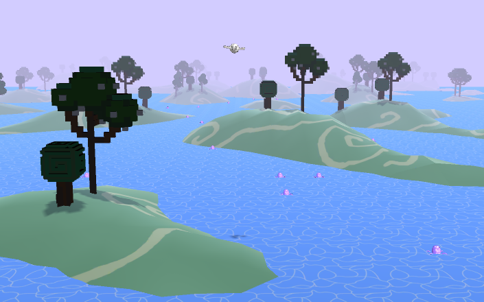

# Nation Feathers
Nation Feathers is a proceduraly generated, top-down, flying game for Android. (<em>Built in 2017</em>)

The game was developed in Unity using C# as a project for an undergraduate game programming class in 2017.
More on the technical details is provided in [Nation_Feathers_Beleg.pdf](./Nation_Feathers_Beleg.pdf) (German).

## Plot
You are a hungry, aquatic bird :bird: on a mission: to eat as many of the squid :octopus: floating on the 
water :ocean: as you can before you starve.

But be careful! The water level is dropping rapidly, and with it the floating 
squid. Navigate your way through the swampy terrain and avoid bumping into the 
hills. 

Bon Apetit! :fork_and_knife:

## Installation instructions
To run the game, simply download [Nation Feathers.apk](./Nation%20Feathers.apk), load it onto your mobile device, and install it by tapping.